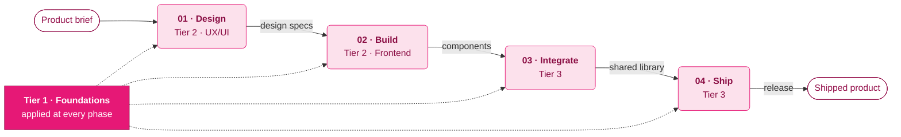

<div align="center">

# Full-Stack Design Skills

**A framework-agnostic UX/UI & frontend curriculum for [Claude Code](https://claude.com/claude-code) — 15 skills that teach universal design principles, demonstrated across three real frameworks.**

Color, accessibility, and design systems → frontend, tokens, and delivery. The principles don't care which framework you use; the six live examples prove it by shipping the *same* system in custom Tailwind, Material 3, **and** Bootstrap 5.

<br>


</div>

---

## Contents

- [Overview](#overview)
- [How the skills work together](#how-the-skills-work-together)
- [The 15 skills](#the-15-skills)
- [Live examples](#live-examples)
- [Quick start](#quick-start)
- [Learning paths](#learning-paths)
- [Design system](#design-system)
- [Repository structure](#repository-structure)
- [Notes & license](#notes--license)

---

## Overview

This repo is two things at once:

1. **A curriculum** — 15 [Agent Skills](https://docs.claude.com/en/docs/claude-code/skills) covering the full arc of building digital products, from first principles to production delivery. Each skill is a self-contained `SKILL.md` (with `references/`) that Claude Code discovers and invokes automatically when your request matches it. The knowledge is **framework-agnostic** — it applies whether you reach for Tailwind, Material, Bootstrap, or hand-rolled CSS.

2. **A component library** — six single-file HTML examples that *apply* the curriculum to real interfaces, each verified in a real browser. One brand, one token layer, **three visual systems** so you can compare approaches side by side.

Everything is **token-driven**, ships **light + dark**, and is held to an explicit **accessibility / anti-AI-pattern** checklist.

---

## How the skills work together

The skills aren't a flat list — they compose into one production pipeline. Five **Tier-1 foundations** underpin every phase, while the rest flow left-to-right from a brief to a shipped product.



| Phase | Skills | Hands off |
|---|---|---|
| **01 · Design** | `figma-expert-workflows` · `responsive-universal-design` · `inclusive-design-patterns` | A design system + responsive, accessible specs |
| **02 · Build** | `frontend-framework-guide` · `css-styling-pixel-perfect` | Coded, styled, pixel-perfect components |
| **03 · Integrate** | `design-to-code-workflow` · `design-tokens-system` · `component-library-mastery` | Distributed tokens + a published library |
| **04 · Ship** | `qa-testing-visual-regression` · `deployment-devops-workflow` | A tested, deployed release |
| **Foundation** | `design-fundamentals` · `web-accessibility-a11y` · `design-systems-architecture` · `web-performance-optimization` · `anti-ai-design-patterns` | The standard every phase is held to |

---

## The 15 skills

### Tier 1 · Core Foundations

Cross-cutting knowledge applied in every phase.

| Skill | What it covers |
|---|---|
| `design-fundamentals` | Color theory, typography, layout & grid, spacing, visual hierarchy |
| `web-accessibility-a11y` | WCAG 2.1, semantic HTML, ARIA, keyboard nav, screen readers |
| `design-systems-architecture` | Tokens, component architecture, governance, scaling |
| `web-performance-optimization` | Core Web Vitals, Lighthouse, asset/network/runtime tuning |
| `anti-ai-design-patterns` | De-slop review: kill AI tells (accent rails, emoji, default palettes) so UI reads as human-crafted |

### Tier 2 · Domain-Specific

<table>
<tr><th>UX / UI branch</th><th>Frontend branch</th></tr>
<tr valign="top"><td>

| Skill |
|---|
| `figma-expert-workflows` |
| `responsive-universal-design` |
| `inclusive-design-patterns` |

</td><td>

| Skill |
|---|
| `frontend-framework-guide` |
| `css-styling-pixel-perfect` |

</td></tr>
</table>

### Tier 3 · Workflow Integration

| Skill | What it covers |
|---|---|
| `design-to-code-workflow` | Single source of truth, spec docs, Figma → code handoff |
| `component-library-mastery` | Storybook, npm publishing, versioning |
| `design-tokens-system` | Token architecture, transformation, multi-platform distribution |
| `qa-testing-visual-regression` | Visual regression, a11y testing, cross-browser, CI |
| `deployment-devops-workflow` | GitHub Actions, release, deploy strategies, rollback |

---

## Live examples

Six self-contained pages in [`skills/examples/`](skills/examples/) — open any in a browser (framework CSS/JS load from CDN). Each was driven and console-checked in a real browser. The **same brand seed (`#E61876`)** runs through all three visual systems.

| Page | Framework | Highlights |
|---|---|---|
| [`design-system.html`](skills/examples/design-system.html) | Custom · Tailwind | **Documentation** — color ramp, gradient, type scale, radius, elevation, tokens table, a11y checklist |
| [`component-showcase.html`](skills/examples/component-showcase.html) | Custom · Tailwind | Buttons, forms, feedback, badges, table, accessible modal, skeleton + a live de-slop self-audit |
| [`dashboard.html`](skills/examples/dashboard.html) | Custom · Tailwind | KPI sparklines, an interactive area chart (hover crosshair), Core Web Vitals, adoption bars, deploy feed |
| [`registration-form.html`](skills/examples/registration-form.html) | Custom · Tailwind | Inline validation, password-strength meter, accessible errors, gradient hero, success state |
| [`material-design.html`](skills/examples/material-design.html) | **Material 3** | Tonal roles, Roboto, Material Symbols, elevation, pill buttons, FAB, filled/outlined fields |
| [`bootstrap.html`](skills/examples/bootstrap.html) | **Bootstrap 5.3** | Real Bootstrap retinted via `--bs-*` tokens, Bootstrap Icons, native `data-bs-theme` dark |

> The point of shipping three frameworks: the skills' principles are **universal**. Flat/Tailwind, Material, and Bootstrap are just delivery vehicles for the same tokens, accessibility rules, and brand.

---

## Quick start

### Use the skills in Claude Code

Skills are auto-discovered from a `.claude/skills/` directory.

```bash
git clone git@github.com:plugin87/full-stack-design-skills.git
cd full-stack-design-skills

# install globally (all projects)
cp -R .claude/skills/*/ ~/.claude/skills/

# — or — use per-project (already shipped here in .claude/skills/)
```

A skill fires when your request matches its `description`, or invoke one by name (e.g. `/design-fundamentals`). Ask an accessibility question → `web-accessibility-a11y` surfaces; ask to "de-slop this UI" → `anti-ai-design-patterns` steps in.

### Open the examples

```bash
cd skills/examples
python3 -m http.server 8000   # visit http://localhost:8000/
```

---

## Learning paths

| Track | Skills | Route |
|---|---|---|
| **Designer** | 11 | Foundations → UX/UI branch → design-to-code · tokens · QA |
| **Developer** | 12 | Foundations → Frontend branch → all of Tier 3 |
| **Full-stack** | 15 | Everything, Tier 1 → 2 → 3 |

---

## Design system

The examples run on one small, deliberate, **framework-agnostic** token layer:

| Aspect | Choice |
|---|---|
| **Brand / CI** | `#E61876` magenta (with a `#E61876 → #94104B` gradient for hero surfaces) |
| **Typography** | Native `system-ui` sans stack — **bring your own** licensed brand typeface at the font token |
| **Icons** | One icon family per system (Lucide · Material Symbols · Bootstrap Icons); never emoji in product UI |
| **Theming** | CSS-variable tokens; light + dark flip values only |
| **Shape** | Radius scale `4 · 6 · 10 · 14 · 20`; elevation kept to flat + one lift |
| **Principles** | WCAG AA+ · visible focus · status = icon **and** text · `prefers-reduced-motion` |

Full documentation lives in [`design-system.html`](skills/examples/design-system.html).

---

## Repository structure

```
.
├── .claude/skills/              # 15 skills, flat — auto-discovered by Claude Code
├── skills/                      # source curriculum + docs
│   ├── manifest.json            #   skill registry & learning paths
│   ├── tier-1-core-foundations/
│   ├── tier-2-domain-specific/
│   ├── tier-3-workflow-integration/
│   └── examples/                # 6 live HTML examples (3 frameworks)
└── master-skills-architecture.zip
```

---

## Notes & license

- **Fonts** — examples ship with a plain `system-ui` stack; **no fonts are bundled**. The original demos used a commercial typeface, deliberately removed. Point the font token at your own licensed font for production.
- **License** — [MIT](LICENSE). Use, adapt, and redistribute the curriculum, references, and examples freely.

<div align="center">
<br>
<sub><b>v1.0.0</b> · Universal design skills for Claude Code — Tailwind · Material 3 · Bootstrap 5</sub>
</div>
